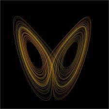

# 🐺

"I was ashamed of myself when I realized that life was a masquerade party and I attended it with my true face" - Franz Kafka.

 

# Welcome

### Memento mori

- Physics 
- Math
- Computer systems
- Philosophy

Ing en sistemas computacionales

Interesado en toda ciencia!!

<!--
**Hiram20buz/Hiram20buz** is a ✨ _special_ ✨ repository because its `README.md` (this file) appears on your GitHub profile.

Here are some ideas to get you started:

- 🔭 I’m currently working on ...
- 🌱 I’m currently learning ...
- 👯 I’m looking to collaborate on ...
- 🤔 I’m looking for help with ...
- 💬 Ask me about ...
- 📫 How to reach me: ...
- 😄 Pronouns: ...
- ⚡ Fun fact: ...
-->

  

 

# :bust_in_silhouette: Información # 
                                           

Numero de control: 20211847.

---------------------------------------------------------
| *Lunes* | *Martes* | *Miercoles* | *Jueves* |
|:----------:|-----------|:-------------:|:----------:|
|    9305    |    LCLC   |      9305     |    LCLB    |
|    17/18   |   17/18   |     17/18     |    17/18   |
  
  

Nombre del maestro: RENE SOLIS REYES.

Materia: Sistemas programables.

Herramientas para clases 
- Arduino clasico
- STM32
- RaspberryPi 
- kit de sensores y herramientas soldar
'''
// This is a comment, and is ignored by the compiler
// You can test this code by clicking the "Run" button over there ->
// or if you prefer to use your keyboard, you can use the "Ctrl + Enter" shortcut

// This code is editable, feel free to hack it!
// You can always return to the original code by clicking the "Reset" button ->

// This is the main function
fn main() {
    // Statements here are executed when the compiled binary is called

    // Print text to the console
    println!("Hello World!");
}
'''
